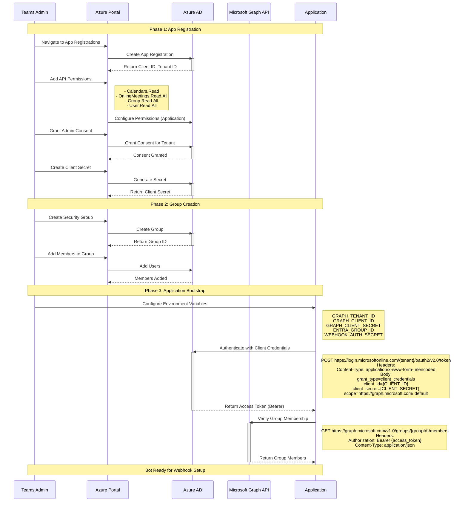
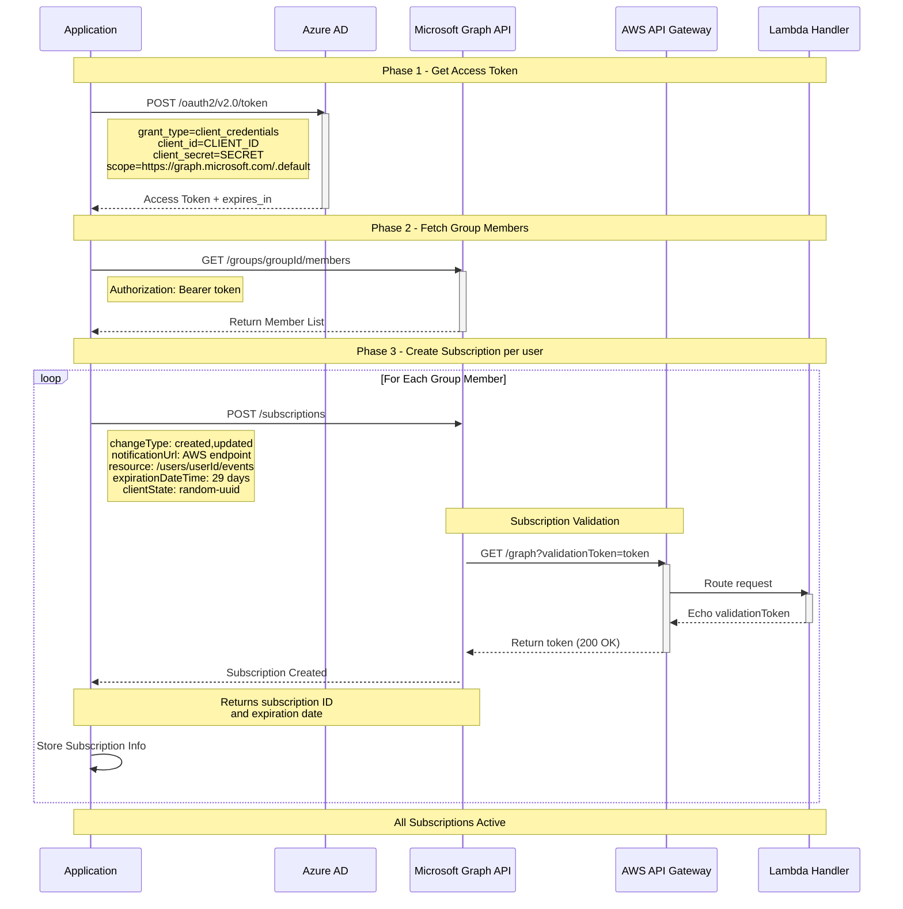
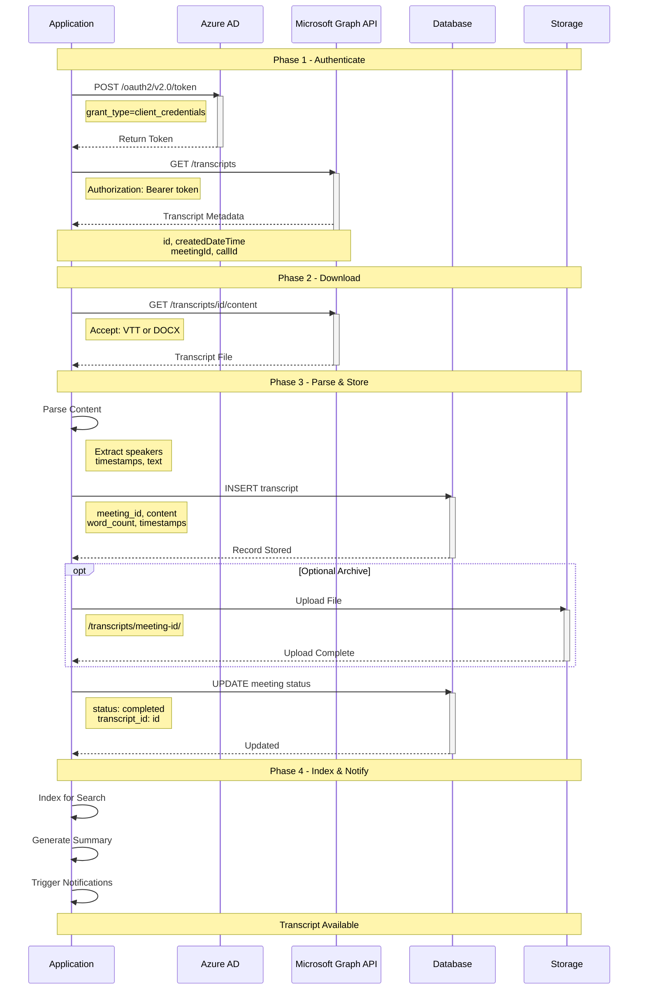

# Teams Meeting Fetcher - Communication Flow Diagrams — Manual/Bootstrap Approach

> **Code-Based Alternative**: For production deployment using Infrastructure as Code (Terraform) and source code references, see the [code-based flow documentation](./flows/README.md).
>
> **This Document**: Consolidated overview of communication flows with emphasis on manual bootstrap scripts and step-by-step setup instructions.

Complete communication flows between Microsoft Graph, Azure AD, AWS Lambda, and the Teams bot service.

## Quick Links to Detailed Flow Documentation

📚 **[View All Flows with Sample Payloads & Infrastructure Details →](./flows/README.md)**

Each flow includes:

- ✅ Detailed sequence diagrams
- ✅ Real webhook payload examples
- ✅ Infrastructure component mapping with Terraform references
- ✅ Source code references with line numbers
- ✅ Deployment and testing instructions

### Individual Flow Documents

1. **[Bot Installation & Initial Setup](./flows/01-bot-installation.md)** - Azure AD app registration, permissions, authentication
2. **[Webhook Subscription Creation](./flows/02-webhook-subscription.md)** - Graph subscriptions with validation handshake
3. **[Meeting Notification Flow](./flows/03-meeting-notification.md)** - Real-time webhook delivery with clientState validation
4. **[Recording Available Notification](./flows/04-recording-available.md)** - Recording events and transcript polling
5. **[Transcript Processing](./flows/05-transcript-processing.md)** - Complete end-to-end meeting lifecycle
6. **[Subscription Renewal](./flows/06-subscription-renewal.md)** - Automated renewal with EventBridge and Lambda

---

## Overview - Consolidated Diagrams

The following sections provide a consolidated view of all communication flows. For detailed information including sample payloads, infrastructure components, and source code references, please refer to the individual flow documents linked above.

## Table of Contents

1. [Bot Installation & Initial Setup](#1-bot-installation--initial-setup)
2. [Webhook Subscription Creation](#2-webhook-subscription-creation)
3. [Meeting Scheduled - Webhook Notification](#3-meeting-scheduled---webhook-notification)
4. [Recording Available - Event Notification](#4-recording-available---event-notification)
5. [Transcript Processing](#5-transcript-processing)
6. [Subscription Renewal](#6-subscription-renewal)

---

## 1. Bot Installation & Initial Setup

Initial bot registration, Azure AD app creation, and permission grants.

**Source Code References:**

- Authentication: [scripts/graph/auth_helper.py](../scripts/graph/auth_helper.py) lines 13-48 (`get_graph_token` - MSAL client credentials flow)
- Headers function: [scripts/graph/auth_helper.py](../scripts/graph/auth_helper.py) lines 51-56 (`get_graph_headers`)
- Config loader: [scripts/graph/auth_helper.py](../scripts/graph/auth_helper.py) lines 59-73 (`get_config`)



---

## 2. Webhook Subscription Creation

Creating Graph webhook subscriptions for each monitored user.

**Source Code References:**

- Authentication: [scripts/graph/auth_helper.py](../scripts/graph/auth_helper.py) lines 13-56
- Create subscription: [scripts/graph/02-create-webhook-subscription.py](../scripts/graph/02-create-webhook-subscription.py) lines 41-82 (`create_subscription`)
- List subscriptions: [scripts/graph/02-create-webhook-subscription.py](../scripts/graph/02-create-webhook-subscription.py) lines 11-36 (`list_subscriptions`)
- Validation handler (GET with validationToken): [apps/aws-lambda/handler.js](../apps/aws-lambda/handler.js) lines 11-19
- Authorizer allows GET: [apps/aws-lambda-authorizer/authorizer.js](../apps/aws-lambda-authorizer/authorizer.js) lines 22-25



---

## 3. Meeting Scheduled - Webhook Notification

When a user schedules a Teams meeting, Graph sends a notification.

**Source Code References:**

- Authorizer clientState validation: [apps/aws-lambda-authorizer/authorizer.js](../apps/aws-lambda-authorizer/authorizer.js) lines 28-31 (allows all POST)
- Handler body parsing: [apps/aws-lambda/handler.js](../apps/aws-lambda/handler.js) lines 21-37
- Handler clientState check: [apps/aws-lambda/handler.js](../apps/aws-lambda/handler.js) lines 44-48
- S3 storage: [apps/aws-lambda/handler.js](../apps/aws-lambda/handler.js) lines 59-75 (key format: `webhooks/{timestamp}-{requestId}.json`)
- 202 Response: [apps/aws-lambda/handler.js](../apps/aws-lambda/handler.js) lines 77-82
- Poll webhooks: [scripts/graph/check_latest_webhook.py](../scripts/graph/check_latest_webhook.py) lines 30-60

```mermaid
sequenceDiagram
    participant User as Teams User
    participant Teams as Microsoft Teams
    participant Graph as Microsoft Graph API
    participant AWS as AWS API Gateway
    participant Auth as Lambda Authorizer
    participant Lambda as Lambda Handler
    participant S3 as S3 Bucket
    participant App as Application
    participant AAD as Azure AD

    Note over User,App: Phase 1 - Meeting Creation

    User->>Teams: Schedule Meeting with Recording
    Teams->>Graph: POST /users/userId/events
    activate Graph
    Note right of Teams: isOnlineMeeting: true<br/>onlineMeetingProvider: teams
    Graph-->>Teams: Event Created
    deactivate Graph

    Note over User,App: Phase 2 - Webhook Notification

    Graph->>AWS: POST /dev/graph
    activate AWS
    Note right of Graph: subscriptionId<br/>changeType: created<br/>clientState: uuid<br/>resource: /users/id/events/id

    AWS->>Auth: Invoke Authorizer
    activate Auth
    Auth->>Auth: Extract clientState
    Auth->>Auth: Compare with CLIENT_STATE

    alt clientState matches
        Auth-->>AWS: Generate Allow Policy
        deactivate Auth

        AWS->>Lambda: Forward Request
        activate Lambda
        Lambda->>S3: Store Webhook Payload
        activate S3
        Note right of Lambda: webhooks/timestamp-id.json
        S3-->>Lambda: Stored
        deactivate S3

        Lambda-->>AWS: 202 Accepted
        Note over Lambda: status: ok<br/>key: webhooks/...
        deactivate Lambda

        AWS-->>Graph: 202 Accepted
        deactivate AWS
    else clientState mismatch
        Auth-->>AWS: Generate Deny Policy
        deactivate Auth
        AWS-->>Graph: 403 Forbidden
        deactivate AWS
    end

    Note over User,App: Phase 3 - App Polling

    App->>S3: Poll for New Webhooks
    activate S3
    S3-->>App: Return Object List
    deactivate S3

    App->>S3: Fetch Latest Payload
    activate S3
    S3-->>App: Return Payload
    deactivate S3

    App->>App: Parse Notification
    App->>App: Extract Event ID

    App->>AAD: Get Access Token
    activate AAD
    AAD-->>App: Return Token
    deactivate AAD

    App->>Graph: GET /users/id/events/id
    activate Graph
    Note right of App: Authorization: Bearer token
    Graph-->>App: Event Details
    Note over Graph,App: subject, organizer<br/>onlineMeeting details
    deactivate Graph

    App->>App: Verify Organizer in Group
    App->>App: Store Meeting in DB

    Note over User,App: Meeting Tracked
```

---

## 4. Recording Available - Event Notification

After meeting ends and recording is processed, Graph sends another notification.

**Source Code References:**

- Webhook handler: [apps/aws-lambda/handler.js](../apps/aws-lambda/handler.js) lines 21-82
- Get recordings: [scripts/graph/04-poll-transcription.py](../scripts/graph/04-poll-transcription.py) lines 26-36 (`get_meeting_recordings`)
- Get transcripts: [scripts/graph/04-poll-transcription.py](../scripts/graph/04-poll-transcription.py) lines 39-50 (`get_call_transcripts`)
- Poll loop: [scripts/graph/04-poll-transcription.py](../scripts/graph/04-poll-transcription.py) lines 68-106 (`poll_for_transcript`)

```mermaid
sequenceDiagram
    participant User as Organizer
    participant Teams as Microsoft Teams
    participant Graph as Microsoft Graph API
    participant AWS as AWS API Gateway
    participant Auth as Lambda Authorizer
    participant Lambda as Lambda Handler
    participant S3 as S3 Bucket
    participant App as Application
    participant AAD as Azure AD

    Note over User,App: Phase 1 - Meeting Recording

    User->>Teams: Start Recording
    Teams->>Teams: Record Meeting
    User->>Teams: Stop Recording
    Teams->>Teams: Process Recording
    Teams->>Graph: Recording Available

    Note over User,App: Phase 2 - Webhook

    Graph->>AWS: POST /dev/graph
    activate AWS
    Note right of Graph: changeType: updated<br/>clientState: uuid

    AWS->>Auth: Validate clientState
    activate Auth
    Auth-->>AWS: Allow
    deactivate Auth

    AWS->>Lambda: Forward Request
    activate Lambda
    Lambda->>S3: Store Payload
    Lambda-->>AWS: 202 Accepted
    deactivate Lambda
    AWS-->>Graph: 202 Accepted
    deactivate AWS

    Note over User,App: Phase 3 - Fetch Recording

    App->>S3: Poll & Fetch Webhook
    activate S3
    S3-->>App: Return Payload
    deactivate S3

    App->>AAD: Get Access Token
    activate AAD
    AAD-->>App: Return Token
    deactivate AAD

    App->>Graph: GET /onlineMeetings/id
    activate Graph
    Note right of App: Authorization: Bearer token
    Graph-->>App: Meeting + Recordings List
    deactivate Graph

    App->>App: Update DB Status
    Note right of App: recording_available

    Note over User,App: Phase 4 - Poll for Transcript

    App->>App: Start Poll Loop
    Note right of App: Every 30s, max 40 retries

    loop Every 30 seconds
        App->>AAD: Get Access Token
        activate AAD
        AAD-->>App: Return Token
        deactivate AAD

        App->>Graph: GET /transcripts
        activate Graph
        Note right of App: Authorization: Bearer token

        alt Transcript Not Ready
            Graph-->>App: Empty Array
            deactivate Graph
            App->>App: Wait 30 seconds
        else Transcript Ready
            Graph-->>App: Transcript List
            deactivate Graph
            App->>App: Exit Poll Loop
        end
    end

    Note over User,App: Polling Active
```

---

## 5. Transcript Processing

Application fetches and stores the completed transcript.

**Source Code References:**

- Get transcripts: [scripts/graph/04-poll-transcription.py](../scripts/graph/04-poll-transcription.py) lines 39-50 (`get_call_transcripts`)
- Download content: [scripts/graph/04-poll-transcription.py](../scripts/graph/04-poll-transcription.py) lines 53-65 (`download_transcript_content`)
- Poll and save: [scripts/graph/04-poll-transcription.py](../scripts/graph/04-poll-transcription.py) lines 68-142
- Auth helper: [scripts/graph/auth_helper.py](../scripts/graph/auth_helper.py) lines 51-56 (`get_graph_headers`)



---

## 6. Subscription Renewal

Graph subscriptions expire after 29 days and must be renewed.

**Source Code References:**

- Renew subscription: [scripts/graph/02-create-webhook-subscription.py](../scripts/graph/02-create-webhook-subscription.py) lines 121-144 (`renew_subscription`)
- Delete subscription: [scripts/graph/02-create-webhook-subscription.py](../scripts/graph/02-create-webhook-subscription.py) lines 104-118 (`delete_subscription`)
- Lambda renewal: [lambda/renewal-function.py](../lambda/renewal-function.py) (automated renewal function)
- Auth helper: [scripts/graph/auth_helper.py](../scripts/graph/auth_helper.py) lines 13-56

```mermaid
sequenceDiagram
    participant Scheduler as Cron
    participant App as Application
    participant DB as Database
    participant AAD as Azure AD
    participant Graph as Microsoft Graph API

    Note over Scheduler,Graph: Daily Renewal Check

    Scheduler->>App: Trigger Renewal

    App->>DB: Query Expiring Subscriptions
    activate DB
    Note right of App: WHERE expiration < NOW() + 3 days
    DB-->>App: Return Subscriptions
    deactivate DB

    loop For Each Expiring Subscription
        App->>AAD: Get Access Token
        activate AAD
        Note right of App: grant_type=client_credentials
        AAD-->>App: Return Token
        deactivate AAD

        App->>Graph: PATCH /subscriptions/id
        activate Graph
        Note right of App: expirationDateTime: +29 days

        alt Subscription Valid
            Graph-->>App: Renewed Successfully
            Note over Graph,App: Returns new expiration
            deactivate Graph

            App->>DB: Update Expiration
            activate DB
            Note right of App: SET expiration_date<br/>last_renewed = NOW()
            DB-->>App: Updated
            deactivate DB
        else Subscription Invalid
            Graph-->>App: 404 Not Found
            deactivate Graph

            Note over App,Graph: Recreate Subscription

            App->>Graph: POST /subscriptions
            activate Graph
            Note right of App: changeType: created,updated<br/>notificationUrl<br/>resource<br/>clientState: new-uuid
            Graph-->>App: New Subscription
            deactivate Graph

            App->>DB: Update Record
            activate DB
            Note right of App: SET graph_subscription_id<br/>client_state<br/>expiration_date
            DB-->>App: Updated
            deactivate DB
        end
    end

    App->>DB: Log Renewal Summary
    activate DB
    Note right of App: renewed_count<br/>failed_count
    DB-->>App: Logged
    deactivate DB

    Note over Scheduler,Graph: Renewals Complete
```

---

## HTTP Headers Reference

### Microsoft Graph API Requests

**Authentication Request (to Azure AD)**

```
POST https://login.microsoftonline.com/{tenant}/oauth2/v2.0/token
Content-Type: application/x-www-form-urlencoded

grant_type=client_credentials
client_id={CLIENT_ID}
client_secret={CLIENT_SECRET}
scope=https://graph.microsoft.com/.default
```

**Graph API Requests**

```
GET|POST|PATCH https://graph.microsoft.com/v1.0/{resource}
Authorization: Bearer {access_token}
Content-Type: application/json
Accept: application/json
```

### Webhook Notifications (Graph → AWS)

**Subscription Validation (GET)**

```
GET /dev/graph?validationToken={token}
Content-Type: application/json
```

**Change Notification (POST)**

```
POST /dev/graph
Content-Type: application/json

{
  "value": [{
    "subscriptionId": "...",
    "clientState": "...",
    "changeType": "created|updated",
    "resource": "...",
    ...
  }]
}
```

### AWS Lambda Responses

**Validation Response (200)**

```
Status: 200 OK
Content-Type: text/plain

{validationToken}
```

**Notification Accepted (202)**

```
Status: 202 Accepted
Content-Type: application/json

{
  "status": "ok",
  "key": "webhooks/{timestamp}-{requestId}.json"
}
```

**Authorization Denied (403)**

```
Status: 403 Forbidden
Content-Type: application/json

{
  "error": "Invalid clientState"
}
```

---

## Security Flow Summary

1. **Azure AD Authentication**: Application uses Client Credentials flow with `client_id` and `client_secret`
2. **Graph API Authorization**: All Graph requests include `Authorization: Bearer {token}` header
3. **Webhook Validation**: Lambda Authorizer validates `clientState` in notification body
4. **AWS IAM Policy**: Authorizer generates Allow/Deny policy for API Gateway
5. **No Direct Bearer on Webhooks**: Graph doesn't send a Bearer token; validation is via `clientState` field

---

## Key Takeaways

- **Client Credentials Flow**: App authenticates to Azure AD as itself (not as a user)
- **Subscription Validation Handshake**: Graph validates endpoint before activating subscription
- **clientState Security**: Random UUID per subscription, validated by Lambda Authorizer
- **Async Processing**: Webhooks return 202 immediately, processing happens via S3 polling
- **Polling for Transcripts**: No webhook for transcript completion; app polls Graph API
- **29-Day Renewal**: Subscriptions must be renewed before expiration

---

## Diagram Validation Summary

All diagram flows have been validated against the actual source code. Key validations:

### Authentication Flow

✅ **Validated**: MSAL client credentials flow matches [auth_helper.py:35-48](../scripts/graph/auth_helper.py#L35-L48)

- Uses `ConfidentialClientApplication` with tenant authority
- Acquires token with `.default` scope
- Returns Bearer token in Authorization header

### Webhook Validation Handshake

✅ **Validated**: GET validation flow matches implementation

- Authorizer [line 22-25](../apps/aws-lambda-authorizer/authorizer.js#L22-L25): Allows GET requests with `validationToken` query
- Handler [line 11-19](../apps/aws-lambda/handler.js#L11-L19): Echoes validationToken with 200 OK status
- Subscription creation [line 75-76](../scripts/graph/02-create-webhook-subscription.py#L75-L76): Posts to Graph with notificationUrl

### Webhook POST Notifications

✅ **Validated**: POST notification flow matches implementation

- Authorizer [line 28-31](../apps/aws-lambda-authorizer/authorizer.js#L28-L31): Allows all POST requests
- Handler [line 44-48](../apps/aws-lambda/handler.js#L44-L48): Validates clientState against `WEBHOOK_AUTH_SECRET`
- Handler [line 59-75](../apps/aws-lambda/handler.js#L59-L75): Stores to S3 with key format `webhooks/{timestamp}-{requestId}.json`
- Handler [line 77-82](../apps/aws-lambda/handler.js#L77-L82): Returns 202 Accepted with `{status: 'ok', key: ...}`

### Graph API Calls

✅ **Validated**: All Graph API endpoints match implementation

- **Subscriptions**: `POST /v1.0/subscriptions` [02-create-webhook-subscription.py:62](../scripts/graph/02-create-webhook-subscription.py#L62)
- **List Subscriptions**: `GET /v1.0/subscriptions` [02-create-webhook-subscription.py:15](../scripts/graph/02-create-webhook-subscription.py#L15)
- **Renew**: `PATCH /v1.0/subscriptions/{id}` [02-create-webhook-subscription.py:127](../scripts/graph/02-create-webhook-subscription.py#L127)
- **Recordings**: `GET /v1.0/users/{email}/onlineMeetings/{id}/recordings` [04-poll-transcription.py:31](../scripts/graph/04-poll-transcription.py#L31)
- **Transcripts**: `GET /v1.0/users/{email}/onlineMeetings/{id}/transcripts` [04-poll-transcription.py:44](../scripts/graph/04-poll-transcription.py#L44)
- **Content**: `GET /v1.0/users/{email}/onlineMeetings/{id}/transcripts/{transcriptId}/content` [04-poll-transcription.py:57](../scripts/graph/04-poll-transcription.py#L57)

### HTTP Headers

✅ **Validated**: All headers match implementation

- **Authorization**: `Bearer {token}` generated by [auth_helper.py:52-56](../scripts/graph/auth_helper.py#L52-L56)
- **Content-Type**: `application/json` set in all Graph requests
- **clientState**: Extracted from env var `WEBHOOK_AUTH_SECRET` [auth_helper.py:71](../scripts/graph/auth_helper.py#L71)

### S3 Storage Pattern

✅ **Validated**: S3 key format matches [handler.js:59](../apps/aws-lambda/handler.js#L59)

```javascript
const key = `webhooks/${timestamp}-${context.requestId}.json`;
```

### Polling Mechanism

✅ **Validated**: Transcript polling implementation [04-poll-transcription.py:68-106](../scripts/graph/04-poll-transcription.py#L68-L106)

- Default: 20 attempts with 30-second delay
- Polls `GET /transcripts` until non-empty array
- Downloads VTT content when available

---

## Detailed Documentation

This document provides a consolidated overview of all communication flows. For comprehensive documentation with:

- **Sample Payloads**: Real webhook examples from debug logs
- **Infrastructure Details**: Terraform module references and AWS resource descriptions
- **Source Code**: Direct links to implementation files with line numbers
- **Testing Instructions**: Manual and automated testing procedures
- **Troubleshooting**: Common issues and resolutions

**👉 Visit the [Individual Flow Documents](./flows/)** for detailed technical documentation.

## Related Documentation

- **[Detailed Flows Directory](./flows/)** - Modular documentation with samples and IAC references
- [Webhook Specification](../specs/docs/webhook-specification.md)
- [API Reference](../specs/docs/api-reference.md)
- [Setup Guide](../specs/setup-guide.md)
- [AWS Lambda Handler](../apps/aws-lambda/handler.js)
- [Lambda Authorizer](../apps/aws-lambda-authorizer/README.md)
