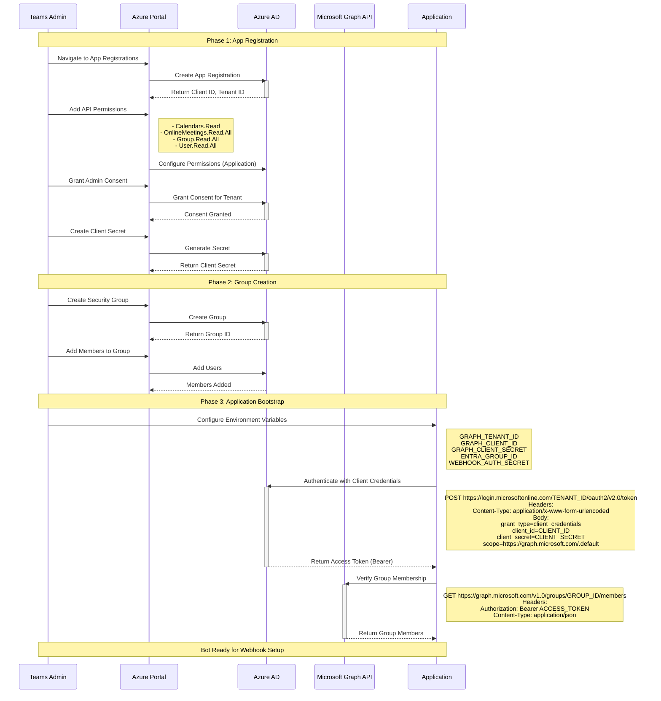

# Flow 1: Bot Installation & Initial Setup

This flow covers the initial Azure AD app registration, permission grants, environment configuration, and first authentication with Microsoft Graph API.

## Sequence Diagram



## Sample Payloads

### OAuth Token Request

```http
POST https://login.microsoftonline.com/{tenant_id}/oauth2/v2.0/token HTTP/1.1
Content-Type: application/x-www-form-urlencoded

grant_type=client_credentials&
client_id=12345678-1234-1234-1234-123456789abc&
client_secret=your-secret-here&
scope=https://graph.microsoft.com/.default
```

### OAuth Token Response

```json
{
  "token_type": "Bearer",
  "expires_in": 3599,
  "ext_expires_in": 3599,
  "access_token": "eyJ0eXAiOiJKV1QiLCJub25jZSI6IjEyMzQ1Njc4OTAiLCJhbGciOiJSUzI1NiIsIng1dCI6..."
}
```

### Group Members Response

```json
{
  "@odata.context": "https://graph.microsoft.com/v1.0/$metadata#directoryObjects",
  "value": [
    {
      "@odata.type": "#microsoft.graph.user",
      "id": "87654321-4321-4321-4321-cba987654321",
      "displayName": "John Doe",
      "mail": "john.doe@contoso.com",
      "userPrincipalName": "john.doe@contoso.com"
    },
    {
      "@odata.type": "#microsoft.graph.user",
      "id": "11111111-2222-3333-4444-555555555555",
      "displayName": "Jane Smith",
      "mail": "jane.smith@contoso.com",
      "userPrincipalName": "jane.smith@contoso.com"
    }
  ]
}
```

## Infrastructure Components

This flow interacts with Azure services and requires no AWS infrastructure at this stage. Configuration must be completed before provisioning AWS resources.

**IaC-first path (recommended):** Provision Azure AD app registration, service principal, and security group via Terraform.

- Terraform entrypoint: [iac/azure/main.tf](iac/azure/main.tf) (module `azure_ad`)
- Module implementation: [iac/azure/modules/azure-ad/](iac/azure/modules/azure-ad/)
- Guide: [iac/azure/README.md](iac/azure/README.md)

### Azure Resources

- **Azure AD App Registration** (Terraform `azure_ad` module, or manual Azure Portal)
  - Purpose: Provides OAuth2 client credentials for application authentication
  - Outputs: `GRAPH_TENANT_ID`, `GRAPH_CLIENT_ID`, `GRAPH_CLIENT_SECRET`
  - Permissions Required:
    - `Calendars.Read` - Read user calendars
    - `OnlineMeetings.Read.All` - Read all online meetings
    - `Group.Read.All` - Read all groups
    - `User.Read.All` - Read all user profiles

- **Azure AD Security Group** (Terraform `azure_ad` module, or manual Azure Portal/Azure CLI)
  - Purpose: Define which users' meetings should be monitored
  - Output: `ENTRA_GROUP_ID`
  - Used by: Graph scripts to fetch group members before creating subscriptions

### Environment Configuration

The application requires environment variables to be set in `.env.local`:

```bash
# Azure AD / Graph API
GRAPH_TENANT_ID=12345678-1234-1234-1234-123456789abc
GRAPH_CLIENT_ID=87654321-4321-4321-4321-cba987654321
GRAPH_CLIENT_SECRET=your-secret-value-here

# Security Group
ENTRA_GROUP_ID=aaaaaaaa-bbbb-cccc-dddd-eeeeeeeeeeee

# Webhook Security
WEBHOOK_AUTH_SECRET=random-generated-uuid-for-clientstate-validation
```

## Source Code References

### IaC Definition (Primary)

- Terraform entrypoint: [iac/azure/main.tf](iac/azure/main.tf)
  - Defines `module "azure_ad"` for app registration, service principal, and group setup
- Azure AD module: [iac/azure/modules/azure-ad/](iac/azure/modules/azure-ad/)
  - Implements app registration, Graph permissions, and group management

### Authentication Implementation (Primary)

**Lambda Implementation** (production code)

- Meeting Bot Handler: [../../lambda/meeting-bot/index.js](../../lambda/meeting-bot/index.js)
  - Implements OAuth2 client credentials flow
  - Acquires Graph API access tokens
  - Manages bot authentication lifecycle

- Graph Client Utilities: [../../lambda/meeting-bot/graph-client.js](../../lambda/meeting-bot/graph-client.js)
  - Builds Graph API requests with authorization headers
  - Token caching and refresh logic
  - Handles OAuth token acquisition

### Bootstrap & Debugging Scripts (Secondary)

**Bootstrap Scripts** (used for initial tenant setup)

- PowerShell: [../../scripts/bootstrap-azure-spn.ps1](../../scripts/bootstrap-azure-spn.ps1)
  - Creates Azure AD Service Principal
  - Assigns required API permissions
  - Generates client secret
  - **Purpose**: One-time tenant initialization

- Bash: [../../scripts/bootstrap-azure-spn.sh](../../scripts/bootstrap-azure-spn.sh)
  - Linux/macOS equivalent of PowerShell bootstrap

**Debugging Scripts** (used for interactive testing)

- Graph Auth Helper: [../../scripts/graph/auth_helper.py](../../scripts/graph/auth_helper.py)
  - `get_graph_token()` (lines 13-48) - MSAL client credentials flow
  - `get_graph_headers()` (lines 51-56) - Authorization header building
  - `get_config()` (lines 59-73) - Configuration loader
  - **Purpose**: Manual testing and validation

- Inventory Audit: [../../scripts/teams/inventory-teams-config.py](../../scripts/teams/inventory-teams-config.py)

## Runtime Locations

- IaC execution: Terraform runs locally or in CI to provision Entra ID resources.
- Production auth code: AWS Lambda (meeting bot handler in [../../lambda/meeting-bot/index.js](../../lambda/meeting-bot/index.js)).
- Manual/bootstrap scripts: run locally from `scripts/`.
  - Audits Azure AD configuration
  - Lists group members and app permissions
  - **Purpose**: Configuration debugging

## Next Steps

After completing bot installation and authentication:

1. ✅ Azure AD app registered with required permissions
2. ✅ Security group created with target users
3. ✅ Environment variables configured
4. ✅ Authentication tested with Graph API

**Next Flow**: [Webhook Subscription Creation](02-webhook-subscription.md)

---

[Back to Flows Index](README.md)
