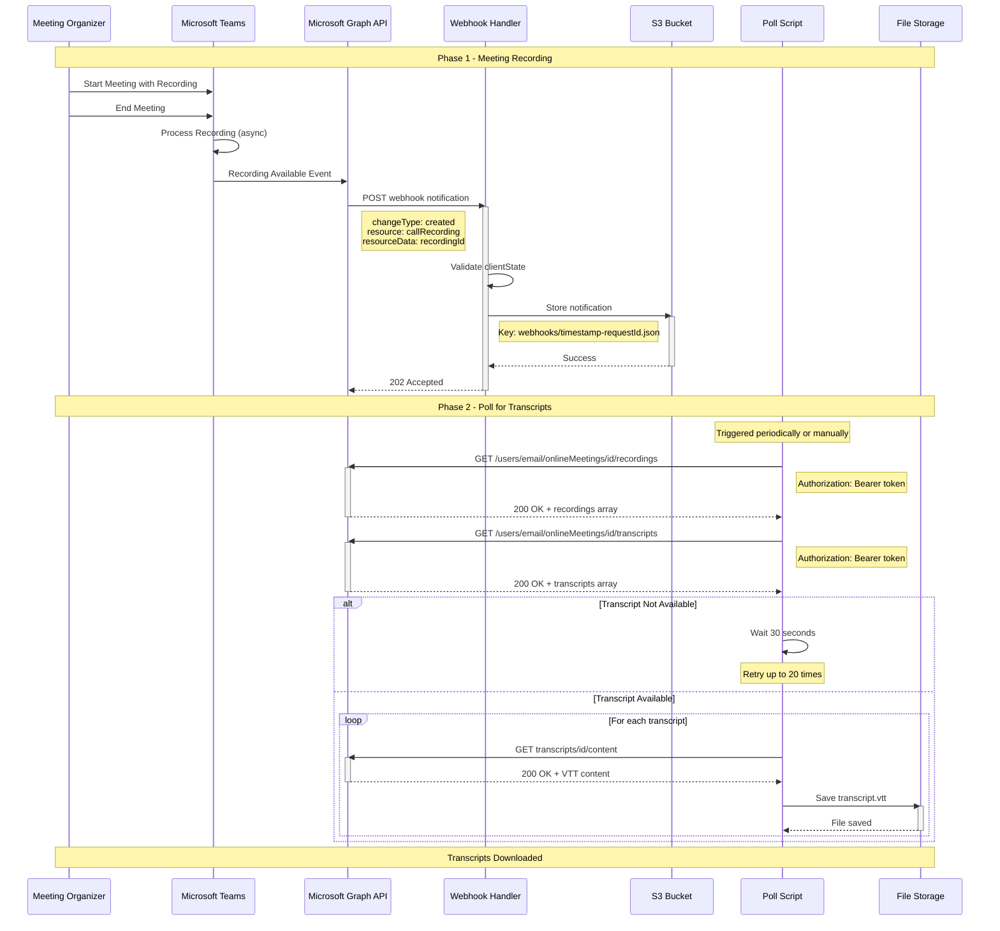

# Flow 4: Recording Available Notification

This flow shows what happens after a Teams meeting ends and the recording becomes available. Microsoft Graph sends a notification, and scripts poll for transcript availability.

## Sequence Diagram



## Sample Payloads

### Recording Available Webhook

**Incoming POST from Graph:**

```json
{
  "value": [
    {
      "subscriptionId": "7f103c7e-4e2e-4d1b-8e0f-7c12345abcde",
      "changeType": "created",
      "resource": "users/john.doe@contoso.com/onlineMeetings/MSpkYzE3Njc0Yy04MWQ5LTRhZGItYmZ/attendeeReport",
      "clientState": "550e8400-e29b-41d4-a716-446655440000",
      "resourceData": {
        "@odata.type": "#microsoft.graph.callRecording",
        "@odata.id": "users/john.doe@contoso.com/onlineMeetings/MSpkYzE3Njc0Yy04MWQ5LTRhZGItYmZ/recordings/MSMjMCMjZDAwYWU3NjUtYjc3MS00MDk1LTkyZDUtM",
        "id": "MSMjMCMjZDAwYWU3NjUtYjc3MS00MDk1LTkyZDUtM",
        "meetingId": "MCMjMCMjOTM1MGM3NDctN2U0MS00ZGIzLWEzOGUtZGFiOTc3MzhjOWE5KjE5OmI0ZmI5MTk4LTQyYzEtNDg3MS1iYzllLTY2YzNjZjhmMmM5MEB0aHJlYWQud",
        "createdDateTime": "2026-02-17T13:45:22.0000000Z"
      },
      "subscriptionExpirationDateTime": "2026-03-19T18:23:45.935Z",
      "tenantId": "12345678-1234-1234-1234-123456789abc"
    }
  ]
}
```

### Get Recordings Response

```json
{
  "@odata.context": "https://graph.microsoft.com/v1.0/$metadata#users('john.doe%40contoso.com')/onlineMeetings('MSpkYzE3Njc0Yy04MWQ5LTRhZGItYmZ')/recordings",
  "value": [
    {
      "id": "MSMjMCMjZDAwYWU3NjUtYjc3MS00MDk1LTkyZDUtM",
      "meetingId": "MCMjMCMjOTM1MGM3NDctN2U0MS00ZGIzLWEzOGUtZGFiOTc3MzhjOWE5",
      "createdDateTime": "2026-02-17T13:45:22.5776389Z",
      "recordingContentUrl": "https://graph.microsoft.com/v1.0/users/john.doe@contoso.com/onlineMeetings/MSpkYzE3Njc0Yy04MWQ5LTRhZGItYmZ/recordings/MSMjMCMjZDAwYWU3NjUtYjc3MS00MDk1LTkyZDUtM/content",
      "meetingOrganizer": {
        "user": {
          "id": "87654321-4321-4321-4321-cba987654321",
          "displayName": "John Doe",
          "userIdentityType": "aadUser"
        }
      }
    }
  ]
}
```

### Get Transcripts Response (Empty - Not Ready Yet)

```json
{
  "@odata.context": "https://graph.microsoft.com/v1.0/$metadata#users('john.doe%40contoso.com')/onlineMeetings('MSpkYzE3Njc0Yy04MWQ5LTRhZGItYmZ')/transcripts",
  "value": []
}
```

### Get Transcripts Response (Available)

```json
{
  "@odata.context": "https://graph.microsoft.com/v1.0/$metadata#users('john.doe%40contoso.com')/onlineMeetings('MSpkYzE3Njc0Yy04MWQ5LTRhZGItYmZ')/transcripts",
  "value": [
    {
      "id": "MSMjMCMjZGF2ZmU3NjUtYjc3MS00MDk1LTkyZDUtOGE0ZmM2MjZmNGU4",
      "meetingId": "MCMjMCMjOTM1MGM3NDctN2U0MS00ZGIzLWEzOGUtZGFiOTc3MzhjOWE5",
      "createdDateTime": "2026-02-17T13:52:18.0000000Z",
      "transcriptContentUrl": "https://graph.microsoft.com/v1.0/users/john.doe@contoso.com/onlineMeetings/MSpkYzE3Njc0Yy04MWQ5LTRhZGItYmZ/transcripts/MSMjMCMjZGF2ZmU3NjUtYjc3MS00MDk1LTkyZDUtOGE0ZmM2MjZmNGU4/content"
    }
  ]
}
```

### Get Transcript Content Response (VTT Format)

```
WEBVTT

00:00:00.000 --> 00:00:03.840
<v John Doe>Hello everyone, thanks for joining today's meeting.</v>

00:00:04.320 --> 00:00:08.960
<v Jane Smith>Hi John, happy to be here. Let's get started with the agenda.</v>

00:00:09.600 --> 00:00:15.200
<v John Doe>Great. First item on the agenda is the Q1 roadmap discussion.</v>

00:00:15.840 --> 00:00:21.440
<v Bob Wilson>I've prepared some slides. Let me share my screen.</v>

00:00:22.080 --> 00:00:27.680
<v Bob Wilson>As you can see here, we have three major initiatives for Q1.</v>
```

## Infrastructure Components

### AWS Resources

**1. Webhook Handler Lambda**

- Module: [`modules/lambda`](../../iac/aws/modules/lambda/)
- Purpose: Receives recording notification and stores to S3
- Same handler as meeting creation notifications
- Code: [`apps/aws-lambda/handler.js`](../../apps/aws-lambda/handler.js)

**2. S3 Bucket**

- Module: [`modules/storage`](../../iac/aws/modules/storage/)
- Purpose: Stores two types of data:
  - Webhook notifications: `webhooks/timestamp-requestId.json`
  - Downloaded transcripts: `transcripts/meetingId/*.vtt` (optional)

**3. CloudWatch Logs**

- Log Group: `/aws/lambda/tmf-webhook-writer-{environment}`
- Contains: Recording notification receipts

### No Dedicated Recording Infrastructure

⚠️ **Important**: There is NO separate webhook notification for transcript completion. The application must poll the Graph API to check when transcripts become available.

Typical timeline:

- **T+0 minutes**: Meeting ends
- **T+2-5 minutes**: Recording available (webhook sent)
- **T+5-15 minutes**: Transcript available (must poll)

## Source Code References

### Webhook Storage (Primary)

Recording notifications use the same handler as meeting notifications:

- File: [`apps/aws-lambda/handler.js`](../../apps/aws-lambda/handler.js) lines 21-82
  - S3 storage (lines 59-75): Same storage mechanism for all webhook types
  - No special logic for recording vs. meeting events
  - Stores to S3 with timestamp-based key

### Transcript Polling (Secondary)

**Interactive Polling Script** (used for manual testing)

- File: [`scripts/graph/04-poll-transcription.py`](../../scripts/graph/04-poll-transcription.py)
  - `get_meeting_recordings()` (lines 26-36) - Get recording list
  - `get_call_transcripts()` (lines 39-50) - Check transcript availability
  - `download_transcript_content()` (lines 53-65) - Download VTT content
  - `poll_for_transcript()` (lines 68-106) - Poll with retry logic
  - **Purpose**: Manual testing and interactive transcript retrieval
  - **Configuration**: 20 attempts, 30s delay (configurable)
    print(f"\n🔄 Polling for transcript...")
    print(f" Meeting ID: {meeting_id}")
    print(f" User: {user_email}")
    print(f" Max attempts: {max_attempts}")
    print(f" Delay: {delay_seconds}s\n")

    for attempt in range(1, max_attempts + 1):
    print(f"[{datetime.now().strftime('%H:%M:%S')}] Attempt {attempt}/{max_attempts}...")

        transcripts = get_call_transcripts(user_email, meeting_id)

        if transcripts:
            print(f"\n✅ Found {len(transcripts)} transcript(s)!\n")

            for idx, transcript in enumerate(transcripts, 1):
                print(f"Transcript {idx}:")
                print(f"  ID: {transcript['id']}")
                print(f"  Created: {transcript.get('createdDateTime', 'N/A')}")

                # Download content
                print(f"  Downloading...")
                content = download_transcript_content(user_email, meeting_id, transcript['id'])
                if content:
                    filename = f"transcript_{meeting_id}_{idx}.vtt"
                    with open(filename, 'w', encoding='utf-8') as f:
                        f.write(content)
                    print(f"  ✅ Saved to: {filename}\n")

            return transcripts

        if attempt < max_attempts:
            print(f"  Transcript not ready, waiting {delay_seconds}s...")
            time.sleep(delay_seconds)

    print(f"\n⚠️ Timeout: Transcript not available after {max_attempts} attempts")
    return None

````

## Usage

### Manual Polling

```bash
cd scripts/graph
python 04-poll-transcription.py

# Will prompt for:
# - User email
# - Meeting ID (from webhook notification)
````

### Automated Polling (Future Enhancement)

Could be implemented as:

1. **EventBridge Rule**: Trigger every 5 minutes
2. **Lambda Function**: Check S3 for recent recording webhooks
3. **Poll Graph**: For transcripts on meetings without transcripts
4. **Store Results**: Save VTT files to S3

## Monitoring

### Check for Recording Webhooks

```bash
# List S3 objects with "recording" in resource field
python scripts/graph/check_latest_webhook.py --limit 50 | grep -i recording
```

### CloudWatch Insights Query

```
fields @timestamp, @message
| filter @message like /recording|transcript/
| sort @timestamp desc
| limit 20
```

## Known Limitations

1. **No Transcript Webhook**: Must poll to detect transcript availability
2. **Variable Transcription Time**: Can take 5-30 minutes after recording
3. **Rate Limiting**: Graph API throttles at 10,000 requests per 10 minutes
4. **Polling Overhead**: Checking every 30 seconds for 20 attempts = 10 minutes max wait

## Next Steps

After recording is available and transcripts are downloaded:

1. ✅ Meeting ended and recorded
2. ✅ Recording notification received and stored
3. ✅ Polling script fetched transcripts
4. ✅ VTT files downloaded locally

**Next Flow**: [Transcript Processing](05-transcript-processing.md)

---

[Back to Flows Index](README.md)
