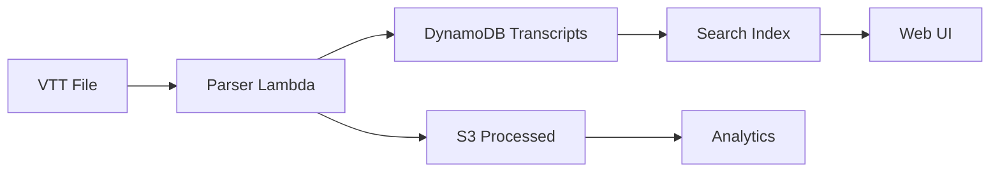

# Flow 5: Transcript Processing Complete Flow

This flow shows the complete end-to-end process from meeting start through transcript retrieval and storage. It consolidates the entire lifecycle into one comprehensive view.

## Sequence Diagram

```mermaid
sequenceDiagram
    participant User as Teams User
    participant Teams as Microsoft Teams
    participant Graph as Microsoft Graph API
    participant Lambda as Webhook Handler
    participant S3 as S3 Bucket
    participant Script as Polling Script
    participant Storage as Local Storage

    Note over User,Storage: Phase 1 - Meeting Lifecycle

    User->>Teams: Start Meeting with Recording
    Teams->>Graph: Meeting Created Event
    Graph->>Lambda: POST webhook (changeType: created)
    activate Lambda
    Lambda->>S3: Store notification
    Lambda-->>Graph: 202 Accepted
    deactivate Lambda

    User->>Teams: Conduct Meeting
    Note over User,Teams: Discussion, presentations, etc.

    User->>Teams: End Meeting
    Teams->>Teams: Generate Recording (async)
    Note over Teams: Processing takes 2-5 minutes

    Note over User,Storage: Phase 2 - Recording Available

    Teams->>Graph: Recording Available
    Graph->>Lambda: POST webhook (changeType: created, callRecording)
    activate Lambda
    Lambda->>S3: Store notification
    Lambda-->>Graph: 202 Accepted
    deactivate Lambda

    Note over Teams: Transcription Processing (5-15 minutes)
    Teams->>Teams: Generate Transcript (async)

    Note over User,Storage: Phase 3 - Transcript Polling

    Script->>S3: List recent webhooks
    activate S3
    S3-->>Script: Webhook objects
    deactivate S3

    Script->>Script: Parse for recording events
    Script->>Script: Extract meetingId and user email

    loop Poll for transcript (max 20 attempts, 30s delay)
        Script->>Graph: GET /users/email/onlineMeetings/id/transcripts
        activate Graph
        Note right of Script: Authorization: Bearer token

        alt Transcript Not Ready
            Graph-->>Script: Empty array
            deactivate Graph
            Script->>Script: Wait 30 seconds
        else Transcript Available
            Graph-->>Script: Transcript metadata
            deactivate Graph
            Script->>Script: Exit poll loop
        end
    end

    Note over User,Storage: Phase 4 - Download & Store

    Script->>Graph: GET transcripts/id/content
    activate Graph
    Note right of Script: Authorization: Bearer token<br/>Accept: text/vtt
    Graph-->>Script: VTT file content
    deactivate Graph

    Script->>Storage: Save transcript_{meetingId}.vtt
    activate Storage
    Storage-->>Script: File saved
    deactivate Storage

    opt Optional S3 Archive
        Script->>S3: Upload to transcripts/meetingId/
        S3-->>Script: Upload complete
    end

    Note over User,Storage: Transcript Available for Processing
```

## Sample Payloads

### Meeting Created Webhook

```json
{
  "value": [
    {
      "subscriptionId": "7f103c7e-4e2e-4d1b-8e0f-7c12345abcde",
      "changeType": "created",
      "resource": "users/john.doe@contoso.com/events/AAMkAGI3NDHLNTI5LWNlYjYtNGRhZi1iZWM2LTJmYWQ0M2I1ZTVkNw",
      "clientState": "550e8400-e29b-41d4-a716-446655440000",
      "resourceData": {
        "@odata.type": "#Microsoft.Graph.Event",
        "@odata.id": "users/john.doe@contoso.com/events/AAMkAGI3NDHLNTI5LWNlYjYtNGRhZi1iZWM2LTJmYWQ0M2I1ZTVkNw",
        "id": "AAMkAGI3NDHLNTI5LWNlYjYtNGRhZi1iZWM2LTJmYWQ0M2I1ZTVkNw"
      },
      "subscriptionExpirationDateTime": "2026-03-19T18:23:45.935Z",
      "tenantId": "12345678-1234-1234-1234-123456789abc"
    }
  ]
}
```

### Recording Available Webhook

```json
{
  "value": [
    {
      "subscriptionId": "7f103c7e-4e2e-4d1b-8e0f-7c12345abcde",
      "changeType": "created",
      "resource": "users/john.doe@contoso.com/onlineMeetings/MSpkYzE3Njc0Yy04MWQ5LTRhZGItYmZ/recordings/MSMjMCMjZDAwYWU3NjUtYjc3MS00MDk1LTkyZDUtM",
      "clientState": "550e8400-e29b-41d4-a716-446655440000",
      "resourceData": {
        "@odata.type": "#microsoft.graph.callRecording",
        "id": "MSMjMCMjZDAwYWU3NjUtYjc3MS00MDk1LTkyZDUtM",
        "meetingId": "MCMjMCMjOTM1MGM3NDctN2U0MS00ZGIzLWEzOGUtZGFiOTc3MzhjOWE5",
        "createdDateTime": "2026-02-17T13:45:22.0000000Z"
      },
      "subscriptionExpirationDateTime": "2026-03-19T18:23:45.935Z",
      "tenantId": "12345678-1234-1234-1234-123456789abc"
    }
  ]
}
```

### Transcript Content (VTT Sample)

```
WEBVTT

NOTE
Transcript generated by Microsoft Teams

00:00:00.000 --> 00:00:03.840
<v John Doe>Hello everyone, thanks for joining today's meeting.</v>

00:00:04.320 --> 00:00:08.960
<v Jane Smith>Hi John, happy to be here. Let's get started with the agenda.</v>

00:00:09.600 --> 00:00:15.200
<v John Doe>Great. First item on the agenda is the Q1 roadmap discussion.</v>

00:00:15.840 --> 00:00:21.440
<v Bob Wilson>I've prepared some slides. Let me share my screen.</v>

00:00:22.080 --> 00:00:27.680
<v Bob Wilson>As you can see here, we have three major initiatives for Q1.</v>

00:00:28.320 --> 00:00:34.560
<v Jane Smith>Thanks Bob. Can you elaborate on the timeline for the first initiative?</v>

00:00:35.200 --> 00:00:41.600
<v Bob Wilson>Sure. We're targeting early March for the initial release.</v>

00:00:42.240 --> 00:00:48.000
<v John Doe>That sounds good. Let's move on to the next agenda item.</v>
```

### Parsed Transcript Data (Example JSON)

This represents how you might parse and structure the VTT content:

```json
{
  "meetingId": "MCMjMCMjOTM1MGM3NDctN2U0MS00ZGIzLWEzOGUtZGFiOTc3MzhjOWE5",
  "transcriptId": "MSMjMCMjZGF2ZmU3NjUtYjc3MS00MDk1LTkyZDUtOGE0ZmM2MjZmNGU4",
  "format": "VTT",
  "duration": "00:48:00",
  "speakers": [
    {
      "name": "John Doe",
      "utterances": 15,
      "totalTime": "12:34"
    },
    {
      "name": "Jane Smith",
      "utterances": 12,
      "totalTime": "10:22"
    },
    {
      "name": "Bob Wilson",
      "utterances": 18,
      "totalTime": "14:45"
    }
  ],
  "segments": [
    {
      "start": "00:00:00.000",
      "end": "00:00:03.840",
      "speaker": "John Doe",
      "text": "Hello everyone, thanks for joining today's meeting."
    },
    {
      "start": "00:00:04.320",
      "end": "00:00:08.960",
      "speaker": "Jane Smith",
      "text": "Hi John, happy to be here. Let's get started with the agenda."
    }
  ],
  "wordCount": 1543,
  "createdDateTime": "2026-02-17T13:52:18.0000000Z",
  "downloadedAt": "2026-02-17T14:05:32.0000000Z"
}
```

## Infrastructure Components

### AWS Resources

**1. S3 Bucket - Webhook Storage**

- Module: [`modules/storage`](../../iac/aws/modules/storage/)
- Resource: `aws_s3_bucket.webhook_storage`
- Purpose: Store all webhook notifications
- Access Pattern:
  - Lambda: PutObject for incoming webhooks
  - Scripts: ListObjects + GetObject for polling
- Lifecycle: No expiration (can be configured)

**2. S3 Bucket - Transcript Storage (Optional)**

- Same bucket, different prefix: `transcripts/`
- Purpose: Archive downloaded VTT files
- Structure: `transcripts/{meetingId}/transcript_{timestamp}.vtt`
- Access: Read/Write from polling scripts

**3. Lambda Handler**

- Module: [`modules/lambda`](../../iac/aws/modules/lambda/)
- Purpose: Store webhooks from Graph
- Code: [`apps/aws-lambda/handler.js`](../../apps/aws-lambda/handler.js)
- No special processing for transcript events

### Local Processing

**Polling Script Environment**

- Python 3.10+
- Dependencies: `msal`, `requests`, `boto3`, `python-dotenv`
- Environment: `.env.local` with Graph credentials
- AWS Credentials: Profile `tmf-dev` for S3 access

## Source Code References

### Webhook Retrieval (Primary)

**S3 Bucket Storage** (production code)

- File: [`apps/aws-lambda/handler.js`](../../apps/aws-lambda/handler.js) lines 59-75
  - Stores all webhook notifications to S3
  - Key format: `webhooks/{timestamp}-{requestId}.json`
  - Used by all webhook types (meeting created, recording, transcript)

### Transcript Polling (Secondary)

**Interactive Polling Script** (used for manual testing)

- File: [`scripts/graph/04-poll-transcription.py`](../../scripts/graph/04-poll-transcription.py)
  - `get_meeting_recordings()` (lines 26-36) - Get recording list
  - `get_call_transcripts()` (lines 39-50) - Check transcript availability
  - `download_transcript_content()` (lines 53-65) - Download VTT content
  - `poll_for_transcript()` (lines 68-142) - Main polling loop
  - **Purpose**: Manual testing and interactive transcript retrieval

**Webhook Inspection Script** (used for manual inspection)

- File: [`scripts/graph/check_latest_webhook.py`](../../scripts/graph/check_latest_webhook.py) lines 30-60
  - Lists recent webhook payloads from S3
  - Parses and displays webhook details
  - **Purpose**: Debug and inspect webhook storage

### VTT Parsing (Example Implementation)

Not currently implemented, but could be added:

```python
def parse_vtt_transcript(vtt_content):
    """Parse VTT transcript into structured data"""
    import re

    segments = []
    current_segment = {}

    for line in vtt_content.split('\n'):
        # Timestamp line
        if ' --> ' in line:
            times = line.split(' --> ')
            current_segment['start'] = times[0].strip()
            current_segment['end'] = times[1].strip()

        # Speaker and text line
        elif line.startswith('<v '):
            match = re.match(r'<v (.+?)>(.+?)</v>', line)
            if match:
                current_segment['speaker'] = match.group(1)
                current_segment['text'] = match.group(2)
                segments.append(current_segment.copy())
                current_segment = {}

    return segments
```

## Processing Pipeline (Future Enhancement)

### Potential Processing Steps

1. **VTT Parsing**
   - Extract speakers, timestamps, utterances
   - Calculate speaking time per participant
   - Generate speaker statistics

2. **Natural Language Processing**
   - Sentiment analysis
   - Topic extraction
   - Action item detection
   - Question identification

3. **Summary Generation**
   - Key points extraction
   - Meeting highlights
   - Decision documentation

4. **Searchable Index**
   - ElasticSearch or OpenSearch
   - Full-text search across all meetings
   - Speaker-specific queries

5. **Notification & Distribution**
   - Email summaries to participants
   - Post to SharePoint/Teams channel
   - Trigger follow-up workflows

### Proposed Architecture



**Additional AWS Resources Needed:**

- Lambda: Transcript parser (Python + NLP libraries)
- DynamoDB: Structured transcript data
- OpenSearch: Full-text search
- EventBridge: Trigger processing when new files arrive

## Usage Examples

### Manual End-to-End Flow

```bash
# Step 1: Check for new webhooks
cd scripts/graph
python check_latest_webhook.py --limit 20

# Step 2: Identify meeting with recording
# Look for resource containing "recording" or "callRecording"

# Step 3: Extract meeting ID and user email from resource path

# Step 4: Poll for transcript
python 04-poll-transcription.py
# Enter user email: john.doe@contoso.com
# Enter meeting ID: MCMjMCMjOTM1MGM3NDctN2U0MS00ZGIzLWEzOGUtZGFiOTc3MzhjOWE5

# Step 5: Transcript saved as transcript_MCM..._.vtt
```

### Automated Processing (Future)

```bash
# EventBridge Rule triggers Lambda every 5 minutes
# Lambda function:
# 1. Scans S3 for new recording webhooks
# 2. Checks if transcript already processed
# 3. Polls Graph API for transcript
# 4. Downloads VTT content
# 5. Runs NLP processing
# 6. Stores structured data
# 7. Indexes for search
```

## Monitoring & Observability

### Key Metrics

- **Webhook Latency**: Time from meeting end to webhook receipt (Graph controlled)
- **Transcription Delay**: Time from recording to transcript availability (5-15 min typical)
- **Poll Efficiency**: Success rate within 20 attempts
- **Download Success**: Percentage of transcripts successfully retrieved

### CloudWatch Dashboards (Proposed)

```
Meeting Processing Pipeline
├── Meetings Created (count)
├── Recordings Available (count)
├── Transcripts Downloaded (count)
├── Processing Errors (count)
└── Average Time to Transcript (duration)
```

## Next Steps

After transcript processing:

1. ✅ Meeting completed
2. ✅ Recording and transcription generated
3. ✅ Webhooks received and stored
4. ✅ Transcript polled and downloaded
5. ✅ VTT file available for analysis

**Next Flow**: [Subscription Renewal](06-subscription-renewal.md)

---

[Back to Flows Index](README.md)
